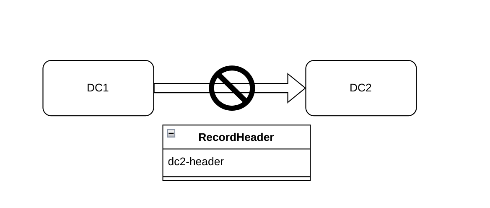
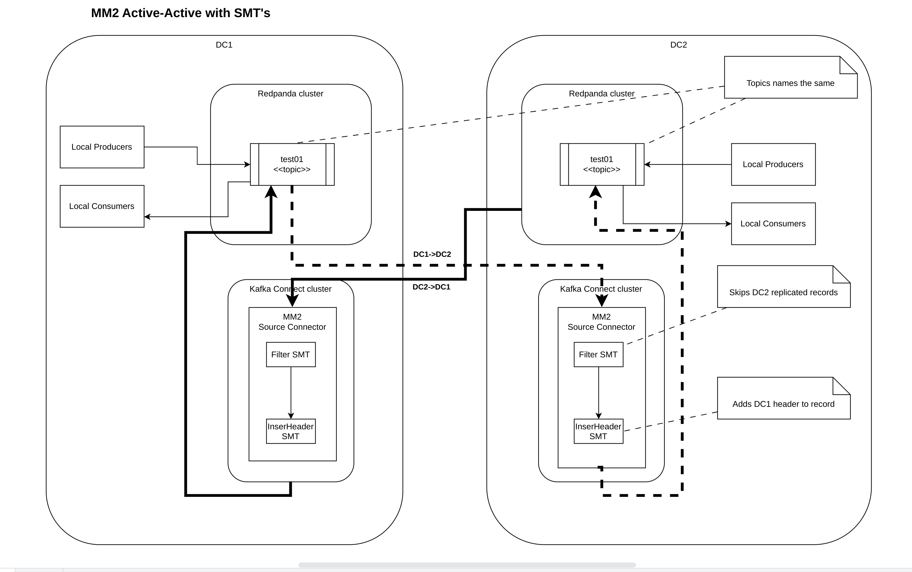
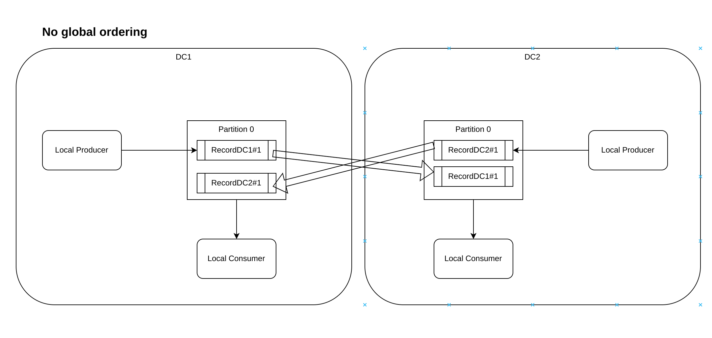

# MM2 Active-Active setup with SMT's

## Introduction

### MM2 replication cycle detection

MM2 uses topic prefixes to prevent replication cycles.
It is possible to configure two clusters to replicate each other ("active/active"), in which case consumers can see all records produced to either cluster in both clusters. To prevent infinite recursion, topics that already contain "us-west" in the prefix won't be replicated to the us-west cluster.

This rule applies to all topics regardless of topology. A cluster can be replicated to many downstream clusters, which themselves can be replicated, yielding topics like us-west, us-east, topic1, and so on. Due to cycle detection, the same cluster alias will not appear twice in a topic name.

MM2 is not allowed to replicate the same topic without aliases, and if I do not specify aliases in configuration files, then we will have a replication message loop.

### The MM2 replication cycle detection using custom record header

MM2 can use the Kafka record header information to skip (do not replicate)
records to a destination cluster if the datacenter ID header of the destination cluster exists in the record header. See the following picture:

 

## MM2 Activy-Activy replication topogogy with SMT's

 We can use [filter](https://docs.confluent.io/cloud/current/connectors/transforms/filter-ak.html) and [insert header](https://docs.confluent.io/platform/current/connect/transforms/insertheader.html) SMTs to skip and to add datacenter header to Kakfa record. See the following deployment diagram for details:

 


<div style="page-break-before:always"></div>
## MM2 Activy-Activy Kafka connect configuration examples

### From DC1 to DC2

```json
{
    "name": "mm2-source-dc1-dest-dc2",
    "config": {
        "connector.class": "org.apache.kafka.connect.mirror.MirrorSourceConnector",
        "topics": "test.*",
        "source.cluster.alias": "source",
        "source.cluster.bootstrap.servers": "redpanda-0.testzone.local:31092",
        "target.cluster.bootstrap.servers": "dc2.testzone.local:19092",
        "key.converter": "org.apache.kafka.connect.converters.ByteArrayConverter",
        "value.converter": "org.apache.kafka.connect.converters.ByteArrayConverter",
        "transforms": "filter,insertDcIdHeader",
        "transforms.filter.type": "org.apache.kafka.connect.transforms.Filter",
        "transforms.filter.predicate": "dc-header",
        "predicates": "dc-header",
        "predicates.dc-header.type": "org.apache.kafka.connect.transforms.predicates.HasHeaderKey",
        "predicates.dc-header.name": "dc2-header",
        "transforms.insertDcIdHeader.type": "org.apache.kafka.connect.transforms.InsertHeader",
        "transforms.insertDcIdHeader.header": "dc1-header",
        "transforms.insertDcIdHeader.value.literal": "DC1",
        "replication.policy.class": "org.apache.kafka.connect.mirror.IdentityReplicationPolicy",
        "sync.topic.configs.enabled": "false"
    }
}
```

<div style="page-break-before:always"></div>

### From DC2 to DC1

```json
{
    "name": "mm2-source-dc2-dest-dc1",
    "config": {
        "connector.class": "org.apache.kafka.connect.mirror.MirrorSourceConnector",
        "topics": "test.*",
        "source.cluster.alias": "source",
        "source.cluster.bootstrap.servers": "dc2.testzone.local:19092",
        "target.cluster.bootstrap.servers": "redpanda-0.testzone.local:31092",
        "key.converter": "org.apache.kafka.connect.converters.ByteArrayConverter",
        "value.converter": "org.apache.kafka.connect.converters.ByteArrayConverter",
        "transforms": "filter,insertDcIdHeader",
        "transforms.filter.type": "org.apache.kafka.connect.transforms.Filter",
        "transforms.filter.predicate": "dc-header",
        "predicates": "dc-header",
        "predicates.dc-header.type": "org.apache.kafka.connect.transforms.predicates.HasHeaderKey",
        "predicates.dc-header.name": "dc1-header",
        "transforms.insertDcIdHeader.type": "org.apache.kafka.connect.transforms.InsertHeader",
        "transforms.insertDcIdHeader.header": "dc2-header",
        "transforms.insertDcIdHeader.value.literal": "DC2",
        "replication.policy.class": "org.apache.kafka.connect.mirror.IdentityReplicationPolicy",
        "sync.topic.configs.enabled": "false"
    }
}
```

<div style="page-break-before:always"></div>

## Active-Acrive replication using the same topic name limitations

When records from two producers (MM2 producer and local producer) interleave in Kafka and are consumed by a consumer, it can have several implications:


- `Cross-Region or Cross-Data Center Traffic costs increase`: When clusters are hosted in different data centers or cloud regions, the data replicated between these clusters will incur data transfer costs. Cloud providers typically charge for data transfer between regions (and sometimes between availability zones within the same region), and these costs can be substantial depending on the volume of data being transferred. The `Filter` SMT filters records based on their headers on the client side (consume side for `source` connectors) and require all records to be consumed, which increases the networking traffic.

- `Processing Overhead`: Interlining can increase the processing overhead for the consumer. The consumer might need to handle records with different schemas or formats, leading to additional parsing or conversion steps.

- `Throughput`: Depending on the consumer's processing logic and resources, interlining may affect throughput. If the consumer needs to perform complex operations on records, interlining can slow down the processing speed.

- `Load Balancing`: Interlining might affect load balancing if multiple consumers are consuming from different partitions. Uneven distribution of records from different producers can lead to an uneven workload for consumers.

- `Error Handling`: Dealing with errors becomes more complex when records from multiple producers are interleaved. The consumer needs to handle errors gracefully and ensure that errors from one producer don't affect the processing of records from other producers.

- `Latency`: Interlining might introduce latency if records from different producers are produced at different rates or if there are delays in producing or consuming records.

- `Global ordering`: No global ordering garantee. See the following diagram for details.

